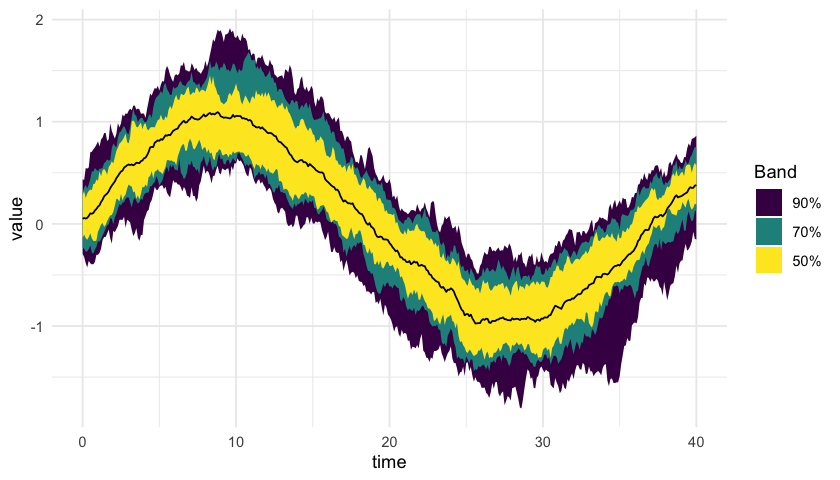

<!-- README.md is generated from README.Rmd. Please edit that file -->

# chromodoris

<!-- badges: start -->

<!-- badges: end -->

chromodoris is an R package in development for one plot type, the
Chromodoris plot. A Chromodoris plot takes many time series, one per
participant or unit, and summarizes them moment by moment as nested
quantile ribbons (for example the inner 90%, 70%, and 50% of values)
around a center line, in place of a spaghetti plot of overlaid series.

The package is a ggplot2 extension with two layers. `stat_chromodoris()`
computes the bands from long data (columns for series id, time, and
value) inside any ggplot pipeline. `chromodoris()` draws the whole plot
with default scales and theme.

## Installation

The package is not on CRAN. Once the GitHub repository is public, you
can install the development version with:

``` r
# install.packages("pak")
pak::pak("jmgirard/chromodoris")
```

## Usage

``` r
library(chromodoris)
set.seed(1)
# 20 raters sampled 10 times per second over 40 seconds: a shared signal,
# a per-rater offset, and slowly drifting per-rater noise.
time <- seq(0, 40, by = 0.1)
d <- expand.grid(time = time, id = 1:20)
d$value <- sin(d$time / 6) +
  rnorm(20, sd = 0.3)[d$id] +
  ave(rnorm(nrow(d), sd = 0.06), d$id,
      FUN = function(e) stats::filter(e, 0.985, method = "recursive"))
chromodoris(d, id, time, value)
```


